## Language 8-step plan

1. Types & typing
2. Primitive types/ops, control flow, strings
3. Methods (functions, procedures)
4. Abstraction & encapsulation
5. Idioms
6. Libraries & dependency management
7. Debugging
8. Testing facilities

## Pair Programming


## Overview & Intro to Ruby for Java programmers

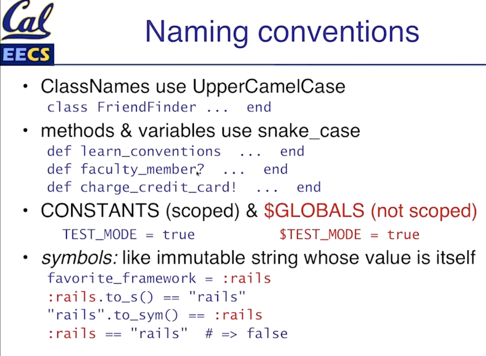

**Variables, Arrays, Hashes**

```ruby
x = 3; x = 'foo'
x = [1, 'two', :three]
x[1] == 'two'; x.length == 3
w = {'a'=>1, :b=>2}
```

**Methods**

Everything is pass-by-reference

```ruby
def foo(x, y)
  return [x, y + 1]
end

def foo(x, y=0) ; [x, y+1] ; end
```

**Basic Constructs**

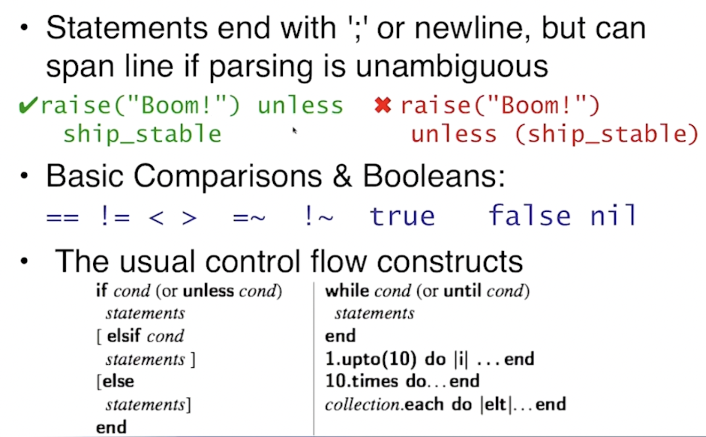

**Strings & Regular Expressions**

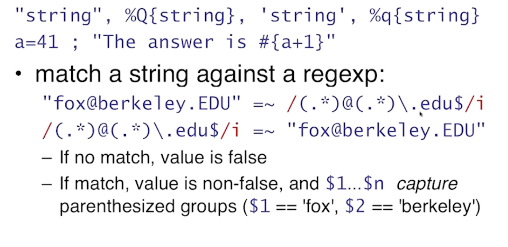

## Everything is an object

```ruby
3.days.ago
50.methods
nil.respond_to?(:to_s)
```


## Classes & inheritance

```ruby
class SavingsAccount < Account
	def initialize(balance=0)
    @balance=balance
  end
  def balance
    @balance
  end
  def balance=(new_amount)
    @balance = new_amount
  end
  def deposit(amount)
    @balance += amount
  end
  @@bank_name = "MyBank.com"
  # A class method
  def self.bank_name
    @@bank_name
  end
end
```


## Poetry mode in action

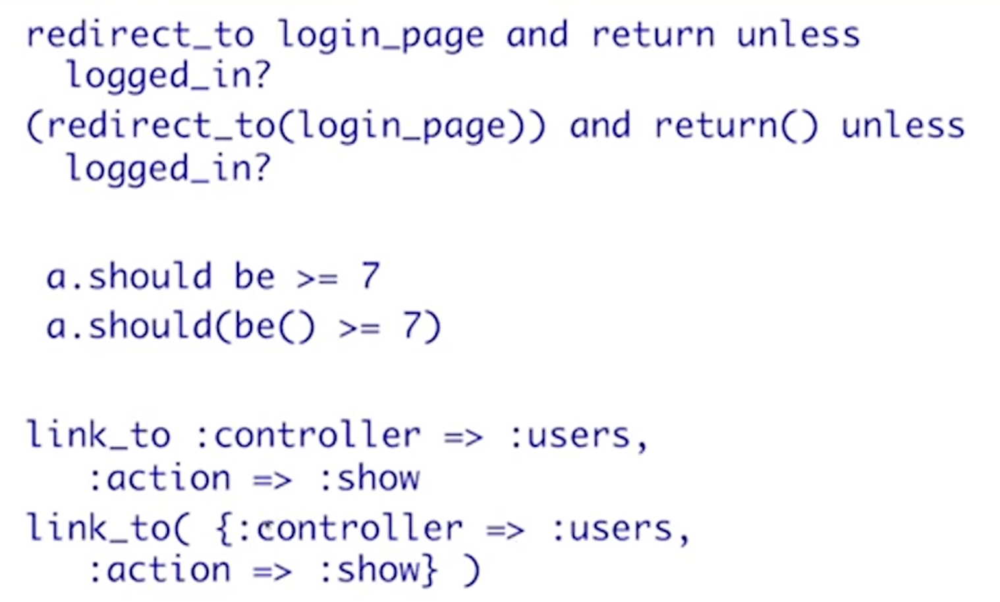


## Block

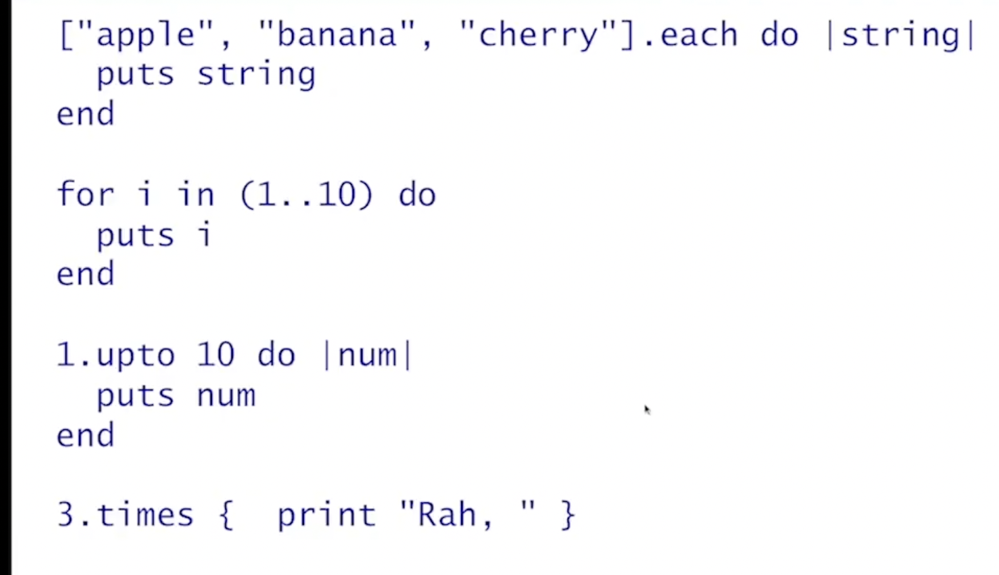

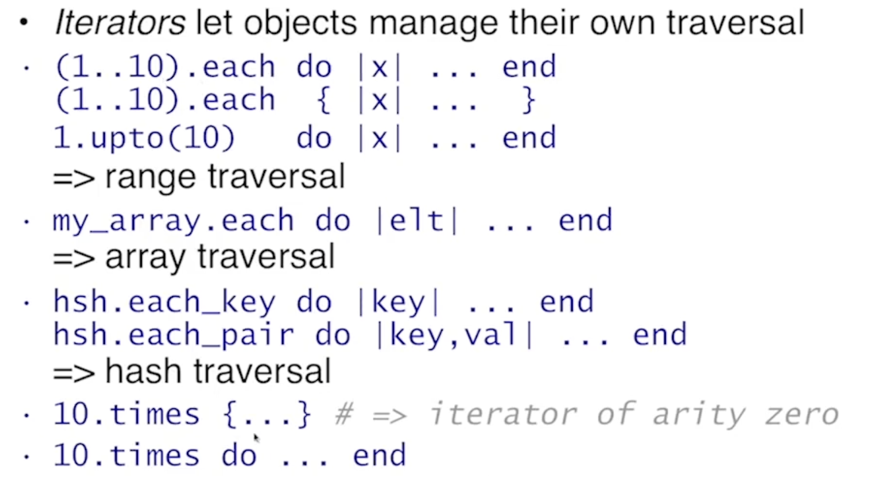

## Modules


## yield()

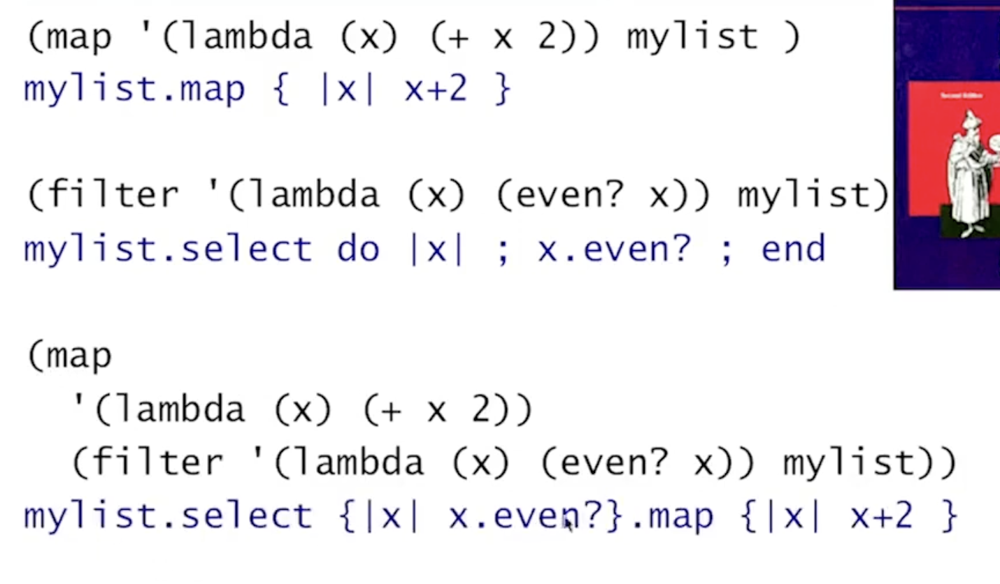

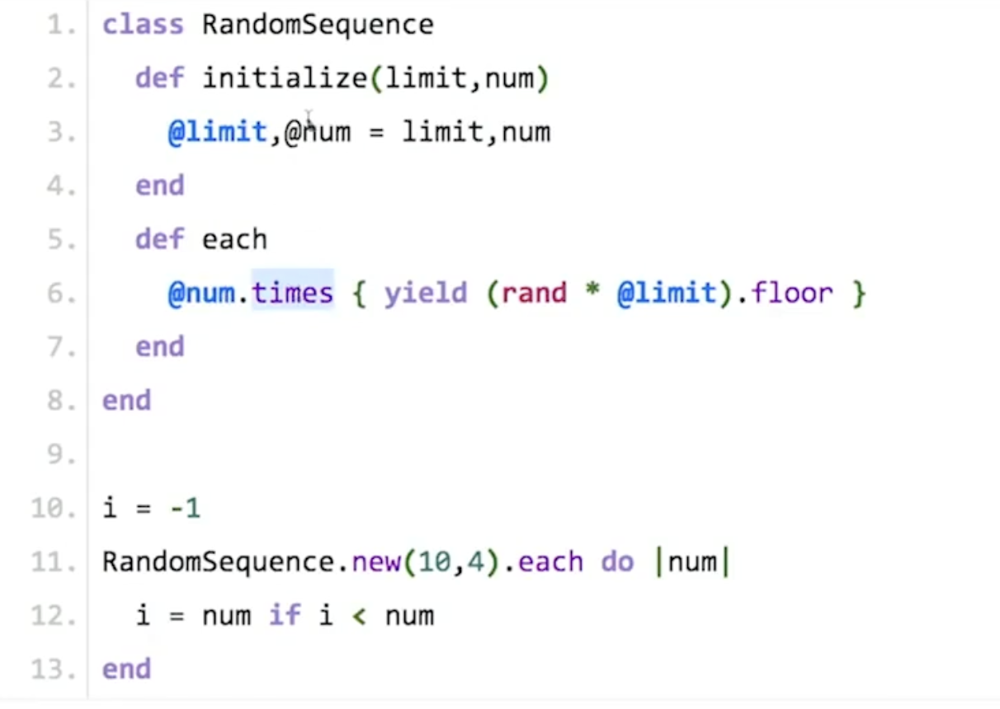

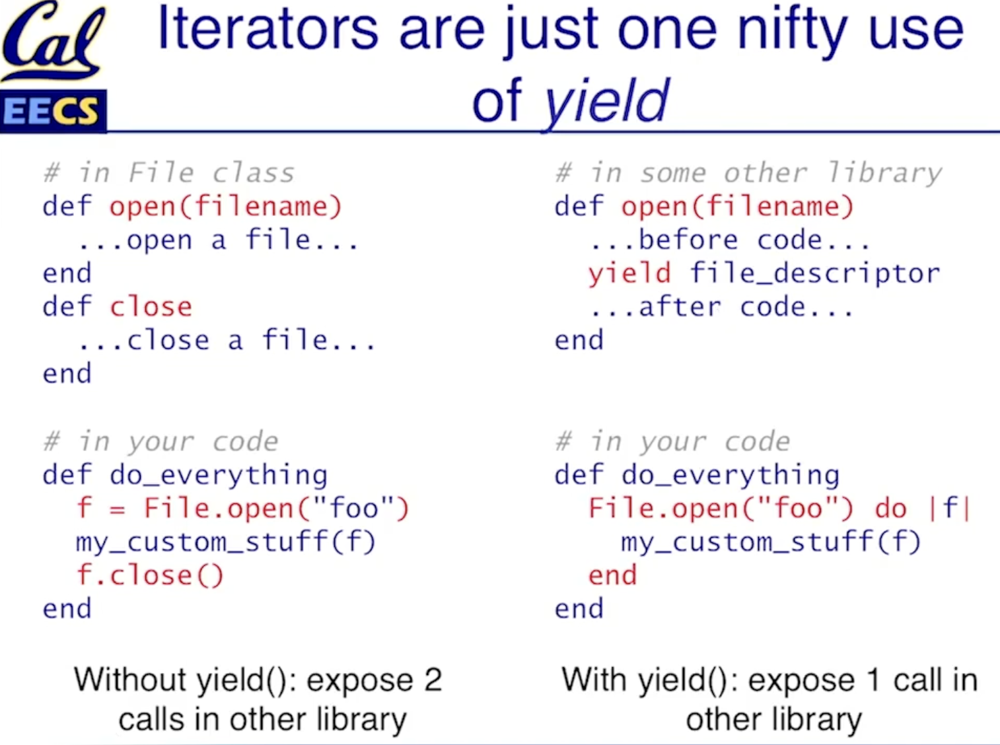

## Metaprogramming & Reflection

```ruby
class Numeric
  def euros; self * 1.292; end
end
```

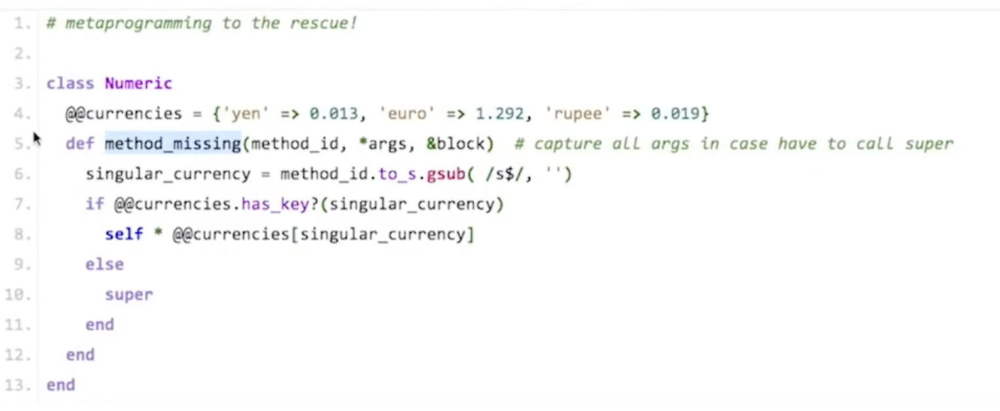


## Package Management System 

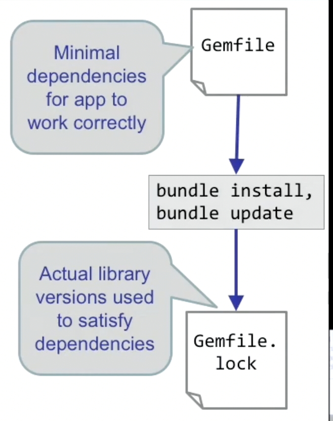
