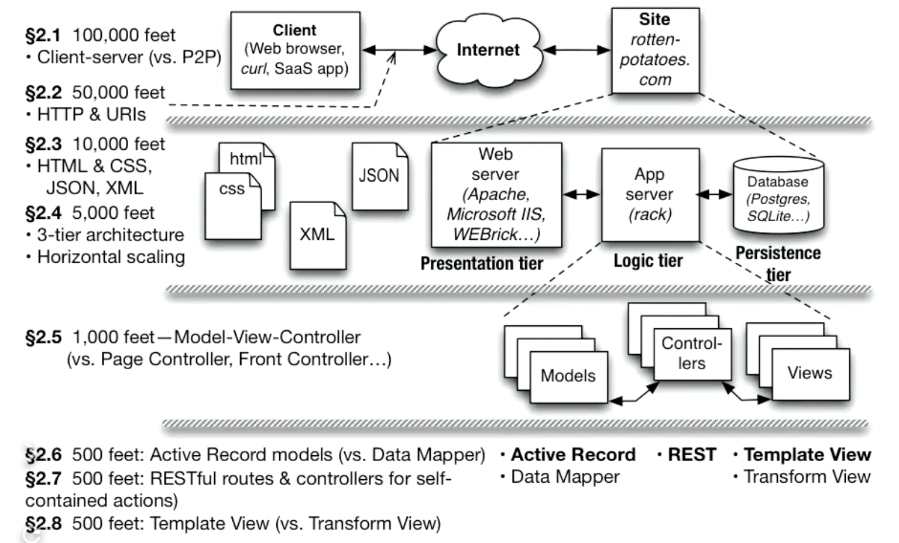
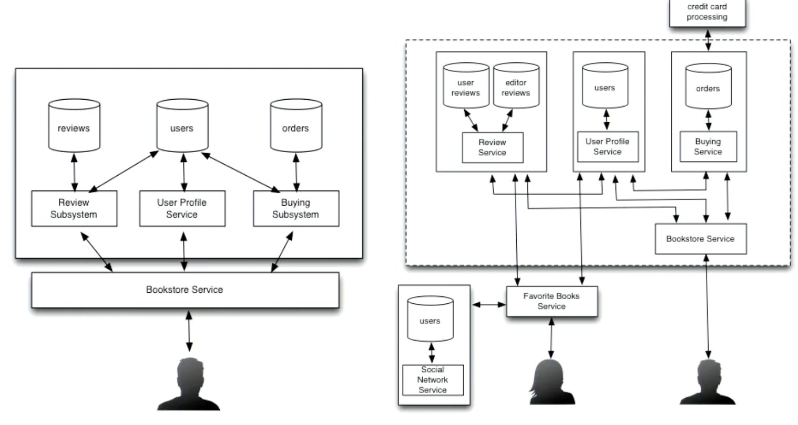
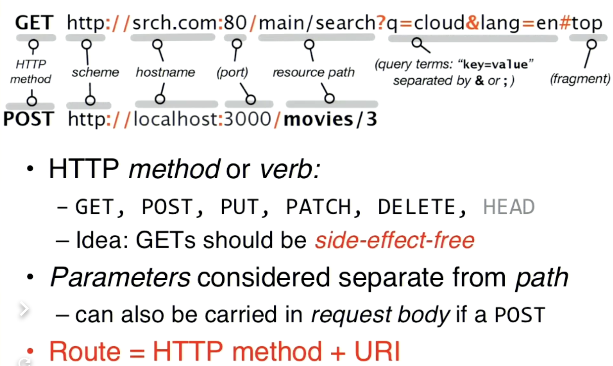

# The Web's  Client - Server Architecture

## HTML & CSS

Bootstrap

## Hypertext Transfer Protocol

## Service Oriented Architecture

## API

 

API framework **REST**

Representational State Transfer

